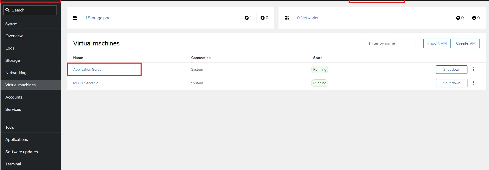
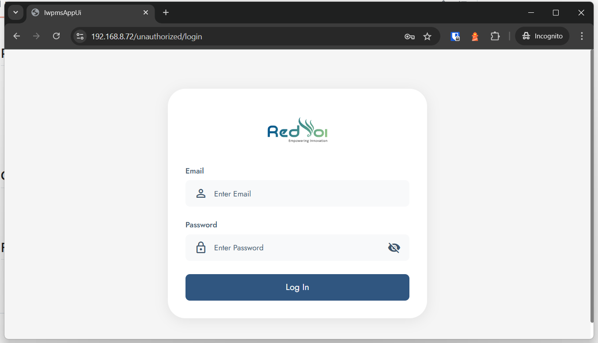
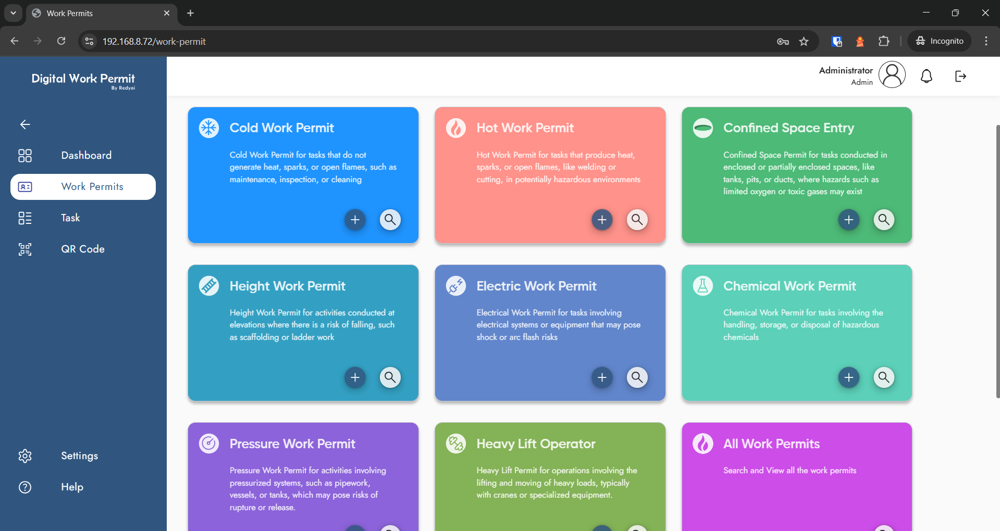

# IWPMS Deployment

## Overview
- Web-based app for work permit management deployed on Ubuntu 24.04.x LTS.
</br>
This project is part of aramco pkg -11 implementation

## Infrastructure
- Web Server: 'appserver2' (192.168.8.72)
- Database Server: 'database2' (192.168.8.79)
- Username: 'testuser' (we're using user :aramco for our implementation)
</br>
Virtualization:
KVM/qemu based machines. </br>
Dashboard - Cockpit ( Image attached here) </br>




</br>

## Pre-Requisites
- Ubuntu: 24.04.1 LTS
- MongoDB: 7.0.7
- Docker: 27.4.0
- Docker Buildx: 0.19.2
- Docker Compose: 2.31.0
- Mongo Shell: 2.2.0

## Setup

⚠️ Note : two docker image (i.e iwpms_client.tar and iwpms_server.tar has been excluded from the
repository for NDA reasons, they should be placed in project root directory)


### Web Server ('appserver2')

1. Install Ubuntu 24.04.1 LTS.
2. Install Docker:
   `sudo apt update && sudo apt install -y docker.io docker-buildx-plugin docker-compose-plugin`</br>
   `sudo systemctl start docker && sudo systemctl enable docker`</br>
   `sudo usermod -aG docker $USER`</br>  
3. Create directory:
   ```bash
   mkdir /home/testuser/iwpms && cd /home/testuser/iwpms
   ```
4. Download artifacts: `iwpms_client.tar`, `iwpms_server.tar`, `files/`, `load_images.sh`, `start.sh`, `deploy.sh`, `app.prod.yml`.
5. Generate HTTPS certificates:
   ```bash
   cd /home/testuser/iwpms/files/cert
   openssl genrsa -out ca.key 2048
   openssl req -x509 -new -nodes -key ca.key -sha256 -days 1095 -out ca.crt -subj "/C=SA/ST=Riyadh/O=testuser/CN=testuserLocalCA"
   ```
6. Deploy:
   ```bash
   ./deploy.sh
   ```
7. Verify Running Containers.

Run `docker ps `
 Here, you should see two container (server & client) up and running successfully, if not, check the logs with (docker logs <container-id>).
 
## Database Server ('database2'):

1. Install Ubuntu 24.04.1 LTS.
2. Install MongoDB:
   ```bash
   sudo apt update && sudo apt install -y mongodb-org=7.0.7
   sudo systemctl start mongod && sudo systemctl enable mongod
   ```
3. Install Mongo Shell:
   ```bash
   sudo apt install -y mongodb-mongosh
   ```
4. Open firewall:
   ```bash
   sudo ufw allow from 192.168.8.72 to any port 27017 proto tcp
   ```
5. Seed database:
   ```bash
   mongosh
   use iwpms
   <copy paste from dbseed.txt above>
   ```
## Post-Deployment
1. Access: `https://192.168.8.72` (Email: `admin@yourcompany.com`, Password: `Test123!`). Now create new admin user with administrator privilege.




2. Delete temp admin:
   ```bash
   mongosh
   use iwpms
   db.getCollection('users').deleteOne({ 'NormalizedEmail': 'ADMIN@YOURCOMPANY.COM' })
   ```

## Cleanup/Troubleshooting time
- ```bash
  docker compose -f app.prod.yml down
  ```

## Files
- `appsettings.json`, `nginx.conf`, `.gitignore`, `app.prod.yml`, `deploy.sh`, `load_images.sh`, `start.sh`, `iwpms_client.tar`, `iwpms_server.tar`

Done 🕺💃💃🕺🥂💦💦